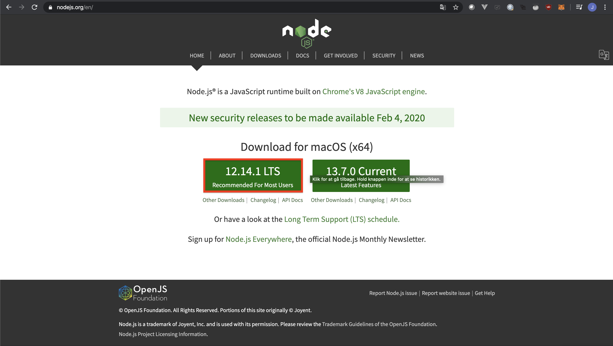
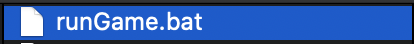
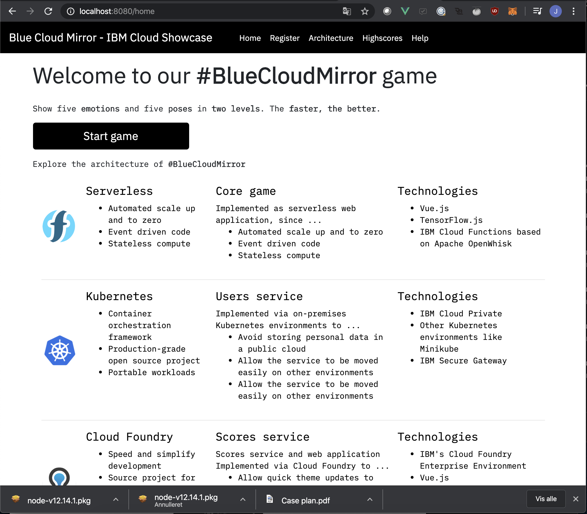

How to run the Blue Cloud Mirror game.** 

**Prerequisites.** 

If you don’t already have Node installed, go to https://nodejs.org/en/ and click on the button which says LTS. A download should begin. After the download is finished, install the program on your machine. 

**How to run** 

**On windows** 

Open up the folder and double-click on the file named “runGame.bat”. After a couple of minutes you should be able to go to your browser on http://localhost:8080 and view the page. 

**On OSX** 

Open up a terminal inside the folder where the files are placed. Then in your terminal write: *“sh runGame.sh”* After a couple of minutes you should be able to go to your browser on http:// localhost:8080 and view the page. 